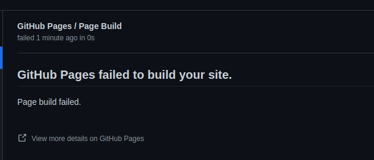
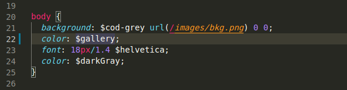
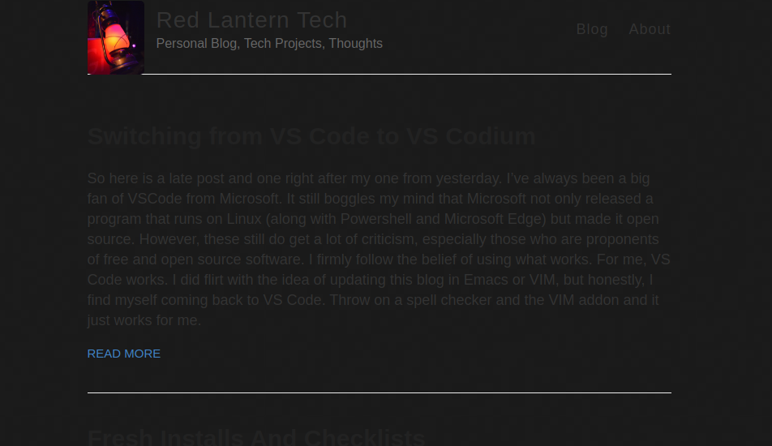
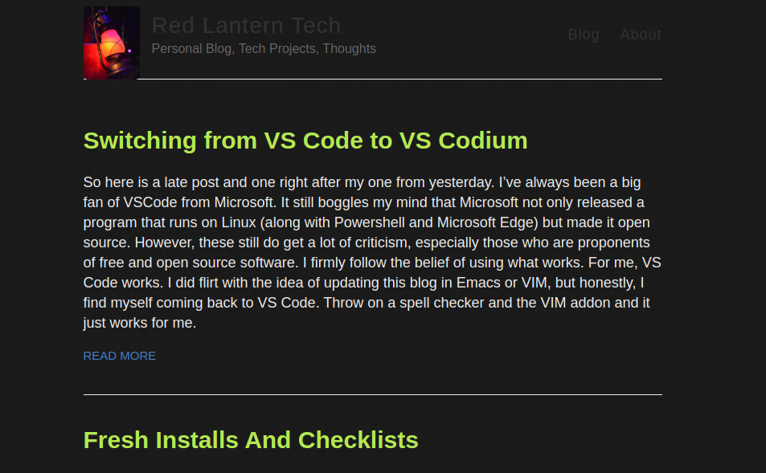
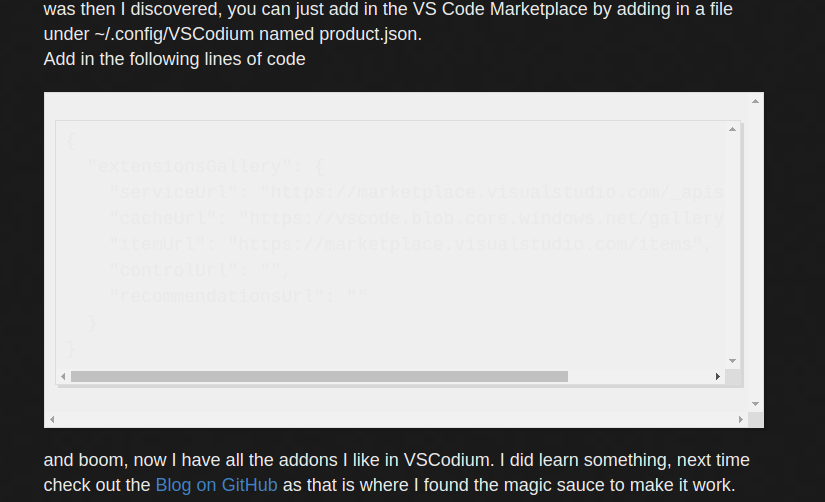
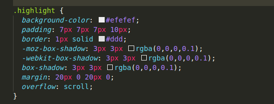
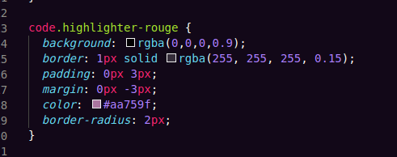

## The Setup
[Jekyll Now](jekyllnow.com) out of the box does look good.  It's simple, and looks good.  However, it is bright, like very bright.
When I was testing themes and Github pages, one of the themes I came across was the [./ Hacker theme](https://pages-themes.github.io/hacker/).  I really
liked its design and how it was easy on the eyes to read.  Looking at its style.css sheets (stored in the _sass folder), I figured I could go in and change
the code for my site.  

That was probably easier said than done.  I spent a few hours on in Friday night changing out the code (hence you are seeing the results).  

## The Process
First thing I tried was to just adding the theme into my _config.yml file

I figured it would not be that simple.  

I decided to add in the color variables from the [./ Hacker theme](https://pages-themes.github.io/hacker) into my _variables.scss and start referencing 
them back in my style.scss file

I started first with messing with the main body of the site

That got me somewhere,

At this point I started working on the font colors.  First I was able to get the headings right.

Then I was able to fix the header and footers as you can see above. 

My next problem came in with the Block Code Box.  First I have to say is I'm fairly confident I messed up something somewhere as it displays with a double-scroll bar.
That was not a problem, this was the problem:

I was a little stuck on this one and I spent some time going though the code.  Fortunately I had remembered the _highlights.scss file and sure enough, that was where
I had to make my change.  

After resolving this issue, I was able to splice in the code that handles the code format highlighting and put that into my styles.css file,

## Lessons Learned and Future Plans
Going though this defiantly gave me a feel on how Jekyll and Github Pages is statically generating the file.  I see now some of the items in the _config.yml file such
as defining kramdom for markdown and importing the rouge highlights works with the code aspect.  Also I really got to see how VSCode/Codium handles pulling in variables and files from other files in the Workspace.  It was super easy to just hit tab and not make spelling mistakes (like I normally do).  Also Git Hub pages, when it has an error, it is not shy and will let you know.

What I should have done, and I still may do this, is reclone or fork [Jekyll Now](https://www.jekyllnow.com) and done my edits from a clean code base and just 
import my posts and images in.  Really I would not have to do much to swap over to it as I have only made a few changes to some of the underlying files (such as the copyright notice).  The [./ Hacker theme](https://pages-themes.github.io/hacker) looks really good and there are a few things I would not mind changing.  I may work
on this as a project as my future projects I'm trying to hold off until after the holidays.  

Another thing, I got really into using the VIM commands in VSCodium with the VIM addon.  There are a few tricks I need to go back over such as yanking lines and moving 
them around.  Though being in VSCodium I can still just do CTRL+C and CTRL+V to get code moved around my file.  I like the VIM codes when moving around the file.  Just is quicker.  

Until then, 73's.  