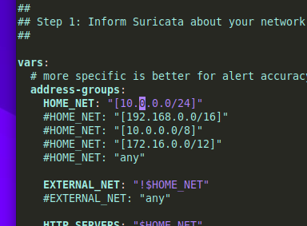
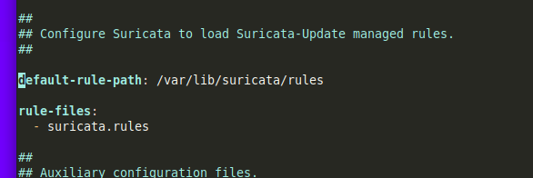
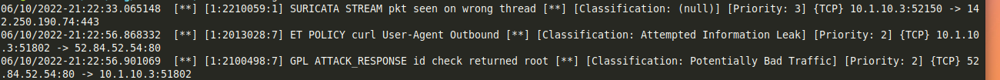

Wanna just skip to the steps?  [Here You Go](https://github.com/RedLanternTech/RLT_TechBook/blob/main/suricatasetup.md)

A few months ago, I attended a training session where it was recommended to run Snort to monitor a compromised (or possibly compromised) machine.  The trainer had used Snort in WSL on a laptop.  WSL is fine and all but I would not want to leave a laptop overnight that I probably depend on.  

So I though, well, Raspberry Pi's are cheap, run Linux, and throw in a smart switch where I can mirror the ports, problem solve.  

I have a couple Raspberry Pi 3b's sitting around doing nothing.  I was able to pick up a TP-Link TL-SG105E to do port forwarding between my cable modem and my Internet of Thing's Network to complete the kit.  

So if I was to do this with a client, my kit would be:
- A Raspberry Pi
- The Switch 

Now, you might be thinking, the title says Suricata, not Snort.  Well, when I started testing this, I was using Kali Linux on the Raspberry Pi.  For whatever reason, Snort was not in the repository.  Fortunately, I had watched [an interesting training video](https://odysee.com/@HackerSploit:26/installing-configuring-suricata:1) on an application called Suricata.

Suricata is compatible and comparable to Snort.  Also it has an advantage over Snort in that it will use all the cores of a multi-core processor.  With a Raspberry Pi 3b being kinda starved for resources, I consider being able to spread the load across multiple an advantage.  

With that said, how did I get it going?  

First thing I did was prepare the operating system for the Raspberry Pi.  I went though a few, starting with Kali, then Ubuntu Server, and finally ending up back at Raspberry Pi OS.  Honestly, Raspberry Pi OS on a Raspberry Pi has always just felt right.  Sure I could get other operating systems going but having access to `raspi-config` to tweak the hardware without manually doing it is nice.  Also with the Minimal install, I get a nice small install with no bloat, so the only thing on here is Suricata. As part of my setup using the official Imager Program, I setup SSH, my hostname, and passwords.  I have the wireless being used to access the Rpi3B with the Ethernet for monitoring only. 

After the install, it was time to update the opearting system, a few reboots later and we are ready to setup and configure Suricata. 

Suricata saves its config in `/etc/suricata/suricata.yaml`.  I have no opinion on Yaml files vs other configs, they are easy to ready and they get the job done.  I had two changes to make.

First, I set HOME_NET to the IP to the IP of my network stack.  
 

Next, in the file, I set the location of my rules.  I set the rules to go to `/var/lib/suricata/rules`

Now I save the file and its time to get things rolling.  

I next run a few commands, first I put the ethernet card into promiscuous mode just to get it to see everything.  Mind you, before doing this, I did configure my switch with port mirroring.  

`sudo ip link set eth0 promisc on`

Next we enable and start Suricata with `sudo systemctl enable suricata.service` followed by `sudo systemctl start suricata.service`

Now we download the rules by running `sudo suricata-update`.  Since I am on a Raspberry Pi 3b with 1gig of ram, this may take a few minutes.

Now here is a tricky part.  This part threw me off for a minute, but you need to run `sudo chmod -R 755 /var/lib/suricata/rules` or Suricata will start and say its running, but load no rules.  After this, run `sudo systemctl restart suricata.service`.  I give it a minute and then I will check `/var/log/suricata/suricata.log` for a SC_ERR_NO_RULES(42) error.  If I see that, I rerun the chmod to reset the permissions and restart the service and check again.  

You have to give Suricata a couple minutes to get going.  From another computer, I run `curl http://testmynids.org/uid/index.html`.  This will generate traffic into the logs.  Though if you give it a minute and watch, you will be amazed how often Google devices reach out.

 

It has been interesting leaving it on for the last day or so.  I definatly have to get in there and fine tune it.  It was a good proof of concept project and if I ever need a small portable IDS, I've got one.  

Something I found I like to run `tail -f /var/log/suricata/fast.log` and keep it up in a terminal so I can watch trafic as it is flagged.  

Another fun thing I did do with this was load Ettercap on here.  It is a good and quick way to do packet capture into a pcap file and then load into Suricata or Wireshark for analysis later.  But that will be a project for another day.

The steps I took to do this can be easily found [in my GitHub](https://github.com/RedLanternTech/RLT_TechBook/blob/main/suricatasetup.md) 

Until then, take care and 73's everyone.

### Further links 
[Suricata's Main Page](suricata.io)

[Video: Installing and Configuring Suricata](https://odysee.com/@HackerSploit:26/installing-configuring-suricata:1)
