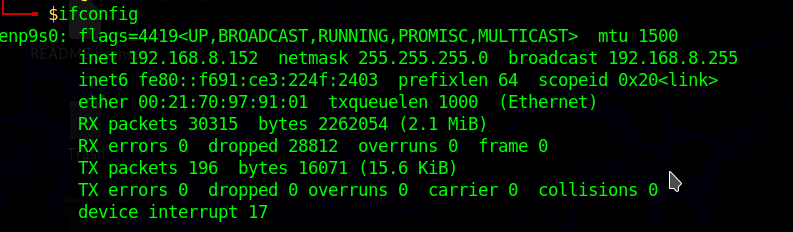
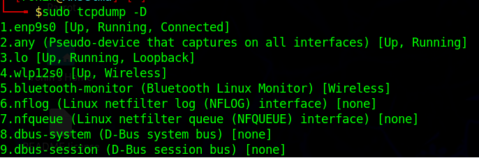
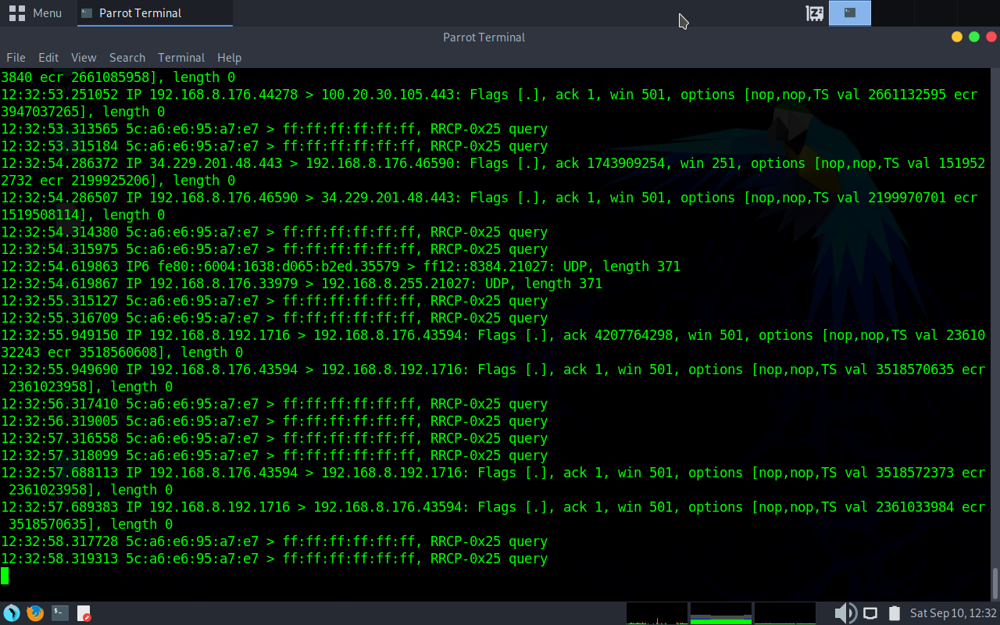
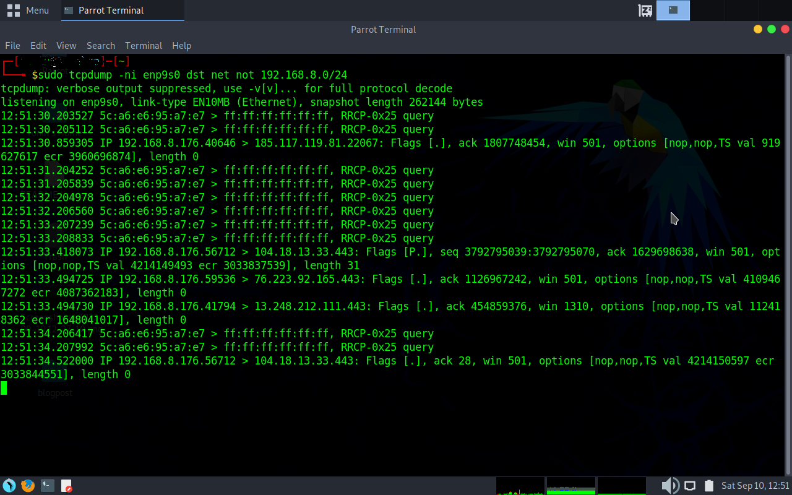

Now that I have finished the CISSP, I thought I would review my traffic analysis skills.  I have been using [Hack the Box Academy](https://academy.hackthebox.com) just to reaclimate my skills. Today I wanted to go back over TCPDump.

TCPDump is a cool packet sniffer that can run right from the command line.  Maybe not have all the bells and whistles as [Ettercap](https://www.ettercap-project.org) or [Wireshark](https://www.wireshark.org), it still gets the job done.

## The test environment.

I am going to run this using actual hardware today as I have my TP Link Switch with a mirrored port setup.  This will be on my "core" network. This network has three computers,  two desktops running Manjaro and a capture machine running Parrot OS.  The Parrot machine is a fresh install so first thing I want to check for is a promiscuous port.  This is probably not needed but I like to just double check.  

To just check, `ifconfig -a`

To set Promiscuous Mode, `sudo ip link set enp9s0 promisc on` (make sure to substitute enp9s0 with the name of your Ethernet Card)

## Time for the fun

Just to be extra sure, lets make sure we can capture from the interface I want (in this case enp9s0) by running `sudo tcpdump -D`

Ok, ready to go, lets do a live capture with no filters to see if we are capturing items (also, I'm going to hide hostnames for some privacy) `sudo tcpdump -ni enp9s0`

A quick breakdown of commands.  The `n` option tells tcpdump to not resolve hostnames (they are not interesting so nothing lost).  In a "live" environment, this would be useful.  The `i` tells tcpdump what interface to use.  

Most of the time, I am interested in what is leaving a network, so I will tell it to filter out my internal network (192.168.8.0/24).  Due to the setup, it will tell me whatever is coming through my monitoring switch outbound.  

`sudo tcpdump -ni enp9s0 dst net not 192.168.8.0/24`

This can come in handy when you want to see what is leaving the network.  While setting up for this post, I noticed a Russian domain coming across my dumps.  Of course, seeing Russian domains can be a little, concerning.  Fortunately combining the TCPDump output along with some basic OSINT, I was able to figure out that it was one of the Global Discovery servers for Syncthing and was hosted in California.  What helped me tie it back was the port used.  Also stopping Syncthing on my main system sealed that it was the culprit.  Might be time to go back to OneDrive or Tresorit.  

I do have in my [Techbook](https://github.com/RedLanternTech/RLT_TechBook) a combination of commands and switches I gathered from the class at Hack the Box and I will be keeping my own searches and filters there as well.  Never hurts to keep track of what you know works.  

Until the next time, take care and 73's
