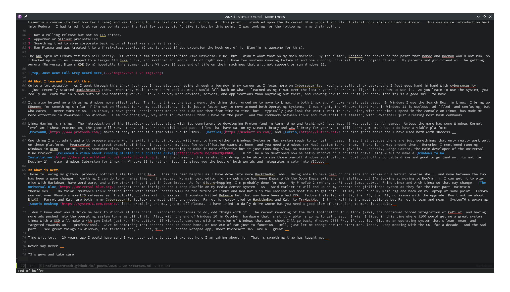

## Where it started. 
I have tried to use Linux off and on since, the late 90's.  I remember finding a copy of Linux on Windows from the Mandrake Linux team at my local big box store.  Only to later discover these
things, called WinModems.  Seriously, why, why come up with something like this?  Anyway if it wasn't crazy drivers or the fact I was stuck on dial-up Internet until 2007, I stuck with Windows.  It played my games, ran applications, and relatively had little friction and stayed out of my way.  

That was until 2021, when I saw the first images of Windows 11.  I had lived through the debacle of Windows 8 (which its server version 2012 was fine), somewhat liked Windows 10, and still missed the glory days of
Windows 2000 Professional (it was good, sorry Windows 98 Second Edition).  I saw the start menu and went, what the frickity frick (staying baby swears here).  Why?  Why? Why can't you just leave the darn start menu
alone Microsoft?  Why can't I just have it be like Windows 10, or 7, or XP (or 2000 Pro/98/95).  Sure you have some great new features like a killer terminal application, tabbed Windows Explorer, improved Task Manager, 
those are great things.  But no, we had, just had to not only make the start menu unusable to any human being, but we decided, that we would stick it in the dead, fricking center of the darn screen and move it from the position it has been in since 1995 for no other reason whatsoever.  

Either way, seeing that Microsoft decided to move the start menu and change it, again, for the 3rd time in the last decade, pushed me over the edge.  By this point in my life, when I sit at home
and use a computer, I do the following items:

1. Use company issued hardware to remote into work.
2. Watch Youtube
3. Look stuff up on the Internet
4. Maybe play a game that I used to play 20 years ago
5. Study for certifications.  

With this, I decided to look back at Linux again.  Again, over the last 20 odd years, I had tried various distributions without any one really sticking.  This would include:

- Mandrake Linux
- Red Hat Linux 6
- The first versions of Fedora Linux (aka Fedora Core)
- Damn Small Linux
- Ubuntu/Kubuntu/Xubuntu/Lubuntu
- FreeBSD
- Solaris (never, never again)
- Slakware (on a 386 with 8mb of ram because I was young and dumb)
- Knoppix (which I once setup in the Windows Lab at Baker College of Flint as a server to host dumb terminals, then PXE booted it off the other systems)

At this point, I had decided to look around.  At the time Fedora still didn't appeal to me and I didn't care for it (hahahahahaha ironic) and Ubuntu with its Gnome desktop didn't tickle my fancy.  I decided to try out Linux Mint.  It's Cinnamon desktop was exactly what I was looking for.  It had that nice Windows 10 look and feel, ran fast, and would run on a portable hard drive that I used to dual boot my Windows system with as I tried things out.  

## How the journey went. 
I dual booted Linux Mint off a portable hard drive until I finally committed to it, purchased a NVMe drive for my system (why id didn't come with it, I din't know) and stayed up with the dual-booting. As time
went on, my usage of Windows became less and less.  For those times I did need Windows, I had setup a virtual machine using QEMU/Virtual Machine Manager to be able to run the one or two Windows applications I needed
for work.  As time went on, I dove deeper and deeper into Linux content creators.  Guys like [Linux Unplugged](https://linuxunplugged.com/), [DistroTube](https://www.youtube.com/channel/UCVls1GmFKf6WlTraIb_IaJg), [LearnLinuxTV](https://www.youtube.com/channel/UCxQKHvKbmSzGMvUrVtJYnUA)
and [The Linux Expermient](https://www.youtube.com/channel/UC5UAwBUum7CPN5buc-_N1Fw) really got me hooked on Linux.  I was able to learn a lot including different commands, programs, and tools to just be better 
effective at using the system.  Learning platforms like [Try Hack Me's Linux Course](https://tryhackme.com/r/room/linuxfundamentalspart1) got me to learn the command line and become very, very proficient.

As I learned more things about Linux, it started me on a distro-hopping frenzy.  I left my main desktop on Linux Mint while I experimented on my laptop. My poor laptop(s) went through Ubuntu, OpenSuse Tumbleweed, ArcoLinux, Manjaro, NixOS, ParrotOS (its non-security tools one).  I settled on Manjaro for a bit before I converted it over on my main desktop.  By around early 2024 my distro journey was slowing down of sorts.  I had just completed the LPI Linux Essentials course (to test how far I came) and was looking for the next distribution to try.  At this point, I stumbled upon the Universal Blue project and its Bluefin/Aurora spins of Fedora Atomic.  This was my re-introduction back into Fedora.  I had tried it at various points over the last few years, didn't like it but by this point, I was looking for the following in my distribution:

1. Not a rolling release but not an LTS either. 
2. AppArmor or SELinux preinstalled
3. Something tied to some corporate backing or at least was a variant of a commercial distribution.  
4. Ran Plasma and was treated like a first-class desktop (Gnome is great if you extension the heck out of it, Bluefin is awesome for this). 

The KDE Spin of Fedora fit this bill nicely.  It wasn't a immutable distribution like Universal Blue, but I didn't want that on my main machine.  By the summer, Manjaro had broken to the point that pamac and pacman would not run, so I backed up my files, swapped to a larger 1TB NVMe drive, and switched to Fedora.  As of right now, I have two systems running Fedora 41 and one running Universal Blue's Project Bluefin. 

## What I learned from all this.  
As I went through this Linux journey, I have also been going through a journey in my career as I focus more on Cybersecurity.  Having a solid Linux background I feel goes hand in hand with securing and protectiong systems, both Linux and Windows.  I just recently started HacktheBox's Labs.  When they would throw a new tool at me, I would fall back on what I learned using Linux over the last 4 years in order to figure it and how to use it.  As you learn to use the system, you really do learn the in's and outs of how something works.  Linux runs way more devices, servers, and applications than anything out there, and knowing how to secure it (or break into it) is a good skill to have.

It's also helped me with using Windows more effectively.  The funny thing, the start menu, the thing that forced me to move to Linux, in both Linux and Windows rarely gets used.  In Windows I use the Search Box, in Linux, I bring up KRunner (or something similar if I'm not on Plasma) to run my applications.  It is just a faster way to move around both Operating Systems.  I was right on my initial assessment, the Windows Start Menu in Windows 11 is confusing, but who cares, I never turn it on.  In Linux, I have great useable start menus and I do use them from time to time, but I typically just look for what I want to run.  Also, with the time I spend in the console on Linux, it has made me more effective in Powershell on Windows.  I am now doing way, way more in Powershell than I have in the past.  And the commands between Linux and Powershell are similar, with Powershell just aliasing most Bash commands.  Having learned how to work in a terminal environment has made me more effective as a technician and saved the end users I support time and frustration.  

Linux Gaming is rising.  The introduction of the SteamDeck by Valve, along with its commitment to developing Proton (and in turn, Wine and ArchLinux) have made it way easier to run games.  Unless the game has some Windows Kernel level Anti-Cheat Protection, the game will run.  I have played recent titles and past titles that have sat on my Steam Library and GoG library for years.  I still don't game much but I do have a viable platform.  [ProtonDB](https://www.protondb.com/) makes it easy to see if a game will run in Linux.  [Bottles](https://usebottles.com/) and [Lutris](https://lutris.net/) are also great tools and I have used both with success.  As more and more games come to the platform, this may result in an increase in Desktop Linux usage.  I don' think it will top Windows anytime soon, but if it gets close to Mac's usage, then that will make it a major player.   

One thing I will admit and will prepare anyone who is switching to Linux, you will want to have either a Windows System or Mac system ready to go just in case.  I say that because there are just somethings that only work on these platforms.  PearsonVue is a great example of this.  I have taken my last few certification exams at home, and you need a Windows (or Mac) system to run them.  There is no way around it, Linux is just not supported.  Remember I mentioned running Windows in QEMU.  For me, it is somewhat slow.  I'm sure I am missing something to make it more effective but it just runs slow, no matter how much power I give it.  Recently, Jorge Castro, the main developer of the Universal Blue Project, [released a video about running Bluefin on a portable drive](https://youtu.be/5DRaYQ6hKU0).  In it, he also mentioned how he setup Windows on a portable drive using Rufus to make a [Windows to Go Installation](https://docs.projectbluefin.io/tips/#windows-to-go).  At the present, this is what I'm doing to be able to run those one-off Windows applications.  Just boot off a portable drive and good to go (and no, its not for Destiny 2).  As a side note, Windows Subsystem for Linux in Windows 11 is rather nice.  It gives you the best of both worlds and integrates nicely into VSCode.  

## What is next.
Those following my github, probably noticed I started using tmux.  This has been helpful as I have dove into HacktheBox labs.  Being able to have nmap on one side and NeoVim or a NetCat reverse shell, and move between the two using just the keyboard, has been a game changer.  Anything I can do to minimize time on the mouse.  My main text editor for my web site has been Emacs with the Doom Emacs extensions installed, but I'm looking at moving to NeoVim, if I can get it to play nice with Markdown, have word warp, and a few other things I get in Doom Emacs.  As for distro-hopping, I'm probably done for now.  My PineTab 2 (which, don't buy) jumps between Rhino Linux and Arch Linux so that may change.  [The Universal Blue](https://universal-blue.org/) project has me intrigued and I keep Bluefin on my media center system.  The Aurora version will (probably) end up on my parents and girlfriend's systems with Windows 10 going end of life in October, and the hardware not able to run Windows 11.  I do think Immutable Linux distributions with atomic updates will be the future of Linux and Red Hat's is the easiest and most fun to get into.  It may end up on my main rig and back on my laptop at some point.  Fedora won out over Ubuntu's non-LTS releases as it actually updates with no issues.  I somehow killed Kubuntu but that may have been a bad PPA.  Fedora I started with 39, then 40, then 41, no issues with the upgrade. Don't ask me about NixOS.  Parrot and Kali are both in my Cybersecurity toolbox and meet different needs.  Parrot is really tied to HacktheBox and Kali to TryHackMe.  I think Kali is the most polished but Parrot is lean and mean.  System76's upcoming [Cosmic Desktop](https://system76.com/cosmic/) looks promising and may get me off Plasma.  I have tried to daily drive Gnome but you need a good slew of extensions to make it useable.  

I don't know what would drive me back to Windows at this point.  Microsoft continues to do, odd things with it.  The recent renaming of the Mail Application to Outlook (New), the continued forced integration of CoPilot, and having more ads pushed into the operating system turns me off of it.  Also, with the end of Windows 10 in October, hardware that is still viable is going to get cheap.  I wish my pre teenage-self lived in this time where $100 would get a great system.  All I can say is keep an eye on Ebay and MSU resell if you need machines to mess with.  Linux with a SSD will make a 4th gen Intel just run like its new.  If Microsoft came out with a version of Windows that was, shoot I'll go back, Windows 2000 Pro, I'd buy it.  Give me an operating system that's lean, mean, and targeted towards an IT professional.  Give me something that doesn't need to phone home, or use 8GB of ram just to function.  Heck, just let me change how the start menu looks.  Stop messing with the GUI for a decade.  And the sad part, I see great things in Windows, the terminal app, VS Code, WSL, the updated Notepad App, shoot Microsoft 365, are all great.  

Time will tell.  20 years ago I would have said I was never going to use Linux, yet here I am taking about it.  That is something time has taught me.  

Never say never.  

73's guys and take care.
